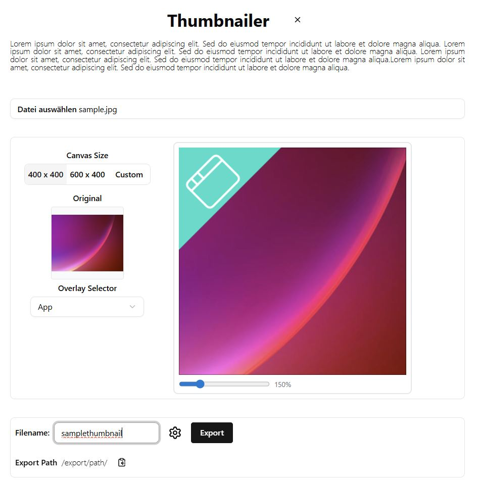
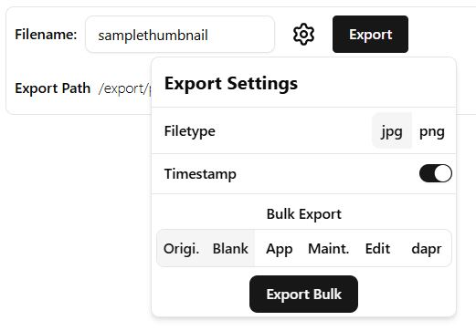

# Thumbnailer

Small, browser-based thumbnail generator built with React + TypeScript. Upload an image, preview overlays, pick canvas sizes and export single or bulk thumbnails.




## Features
- Live preview canvas with multiple overlay types. Add to your liking.
- Export single image or bulk exports with configured overlays
- Filename, format (`jpg` / `png`) and optional timestamp suffix
- Configurable defaults in defaultConfig.ts or direct on build via `public/config.json`

## Quick start
- clone repo
- adjust `src\config\defaultConfig.ts` or `public\config.json` to your needs, add/exchange overlays
- dev, build, deploy
- ```bash
  # install
  npm install
- ```bash
  # dev
  npm run dev
- ```bash
  # build
  npm run build